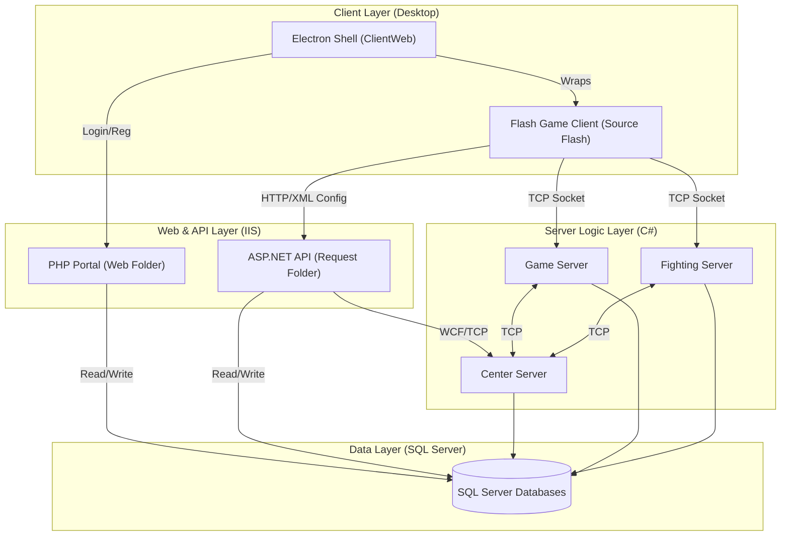

# Architecture & Workflow

## Component Relationship Diagram

## Workflow Summary

1.  **Authentication**: User registers or logs in via the **PHP Portal** or the **Electron Login** interface.
2.  **Initialization**: The **Electron Client** loads the **Flash Game**. The Flash client makes HTTP requests to the **ASP.NET Request** API to download game configuration (XML), ball lists, maps, and shop data.
3.  **World Connection**: The client establishes a persistent TCP Socket connection to the **Game Server** for real-time interaction in the game world.
4.  **Combat**: When a battle starts, the **Game Server** and **Center Server** coordinate to hand off the player session to the **Fighting Server**, which handles the match physics and logic.
5.  **Persistence**: All game events, item purchases, and level-ups are saved to the **SQL Server** via the **SqlDataProvider** layer used by all server components.
